# Diagram Architektury UI - System Autentykacji 10xDevs-10xCards

<architecture_analysis>

## Analiza Architektury UI

### Komponenty wymienione w specyfikacji:

#### Nowe komponenty autentykacji (do utworzenia):

- LoginForm.tsx - formularz logowania z walidacją
- RegisterForm.tsx - formularz rejestracji z walidacją
- ForgotPasswordForm.tsx - formularz odzyskiwania hasła
- ResetPasswordForm.tsx - formularz resetowania hasła
- AuthButton.tsx - przycisk logowania/wylogowania w nawigacji

#### Istniejące komponenty (do modyfikacji):

- GenerationView.tsx - dodanie komunikatu o potrzebie logowania dla zapisywania
- Layout.astro - dodanie nawigacji z przyciskami auth

#### Nowe strony (do utworzenia):

- /auth/login.astro - strona logowania
- /auth/register.astro - strona rejestracji
- /auth/forgot-password.astro - strona odzyskiwania hasła
- /auth/reset-password.astro - strona resetowania hasła
- /auth/logout.astro - endpoint wylogowania
- /my-flashcards.astro - zarządzanie fiszkami użytkownika
- /study-session.astro - sesja nauki z algorytmem powtórek

#### Istniejące strony (bez zmian):

- /index.astro - strona główna
- /generate.astro - generowanie fiszek (dostępne dla wszystkich)

#### Middleware i API:

- /middleware/index.ts - weryfikacja sesji i ochrona tras
- /api/auth/\* - endpointy autentykacji (login, register, logout, etc.)

### Przepływ danych:

1. Użytkownik interaguje z formularzami autentykacji
2. Komponenty React walidują dane po stronie klienta
3. Dane wysyłane do API endpointów Astro
4. API komunikuje się z Supabase Auth
5. Middleware weryfikuje sesję przy każdym żądaniu
6. Stan użytkownika przekazywany do komponentów przez Astro.locals

### Funkcjonalność komponentów:

- Komponenty formularzy obsługują walidację i stany loading/error
- AuthButton dynamicznie wyświetla opcje logowania/wylogowania
- Middleware automatycznie chroni trasy wymagające autentykacji
- Progressive enhancement - aplikacja działa bez logowania, więcej funkcji po zalogowaniu

```mermaid
flowchart TD
    %% Użytkownik i Przeglądarka
    User([Użytkownik]) --> Browser[Przeglądarka]

    %% Layout i Middleware
    Browser --> Layout["Layout.astro<br/>Główny layout z nawigacją"]
    Layout --> Middleware["Middleware<br/>Weryfikacja sesji"]

    %% Podgrupy dla lepszej organizacji
    subgraph "Warstwa Prezentacji"
        direction TB

        subgraph "Strony Publiczne"
            IndexPage["/index.astro<br/>Strona główna"]
            GeneratePage["/generate.astro<br/>Generowanie fiszek"]
        end

        subgraph "Strony Autentykacji"
            LoginPage["/auth/login.astro<br/>Strona logowania"]
            RegisterPage["/auth/register.astro<br/>Strona rejestracji"]
            ForgotPage["/auth/forgot-password.astro<br/>Odzyskiwanie hasła"]
            ResetPage["/auth/reset-password.astro<br/>Reset hasła"]
            LogoutPage["/auth/logout.astro<br/>Wylogowanie"]
        end

        subgraph "Strony Chronione"
            FlashcardsPage["/my-flashcards.astro<br/>Moje fiszki"]
            StudyPage["/study-session.astro<br/>Sesja nauki"]
        end
    end

    subgraph "Komponenty React"
        direction TB

        subgraph "Komponenty Autentykacji"
            LoginForm["LoginForm.tsx<br/>Formularz logowania"]
            RegisterForm["RegisterForm.tsx<br/>Formularz rejestracji"]
            ForgotForm["ForgotPasswordForm.tsx<br/>Formularz odzyskiwania"]
            ResetForm["ResetPasswordForm.tsx<br/>Formularz resetowania"]
            AuthButton["AuthButton.tsx<br/>Przycisk auth w nawigacji"]
        end

        subgraph "Komponenty Fiszek"
            GenerationView["GenerationView.tsx<br/>Widok generowania<br/>(rozszerzony o auth)"]
            TextInputForm["TextInputForm.tsx<br/>Formularz tekstu"]
            FlashcardList["FlashcardList.tsx<br/>Lista fiszek"]
            FlashcardItem["FlashcardItem.tsx<br/>Pojedyncza fiszka"]
            ActionBar["ActionBar.tsx<br/>Pasek akcji"]
        end
    end

    subgraph "Warstwa API"
        direction TB

        subgraph "Endpointy Autentykacji"
            LoginAPI["/api/auth/login.ts<br/>POST - Logowanie"]
            RegisterAPI["/api/auth/register.ts<br/>POST - Rejestracja"]
            ForgotAPI["/api/auth/forgot-password.ts<br/>POST - Odzyskiwanie"]
            ResetAPI["/api/auth/reset-password.ts<br/>POST - Reset hasła"]
            LogoutAPI["/api/auth/logout.ts<br/>POST - Wylogowanie"]
        end

        subgraph "Endpointy Fiszek"
            GenerateAPI["/api/flashcards/generate.ts<br/>POST - Generowanie"]
            FlashcardsAPI["/api/flashcards.ts<br/>CRUD - Zarządzanie"]
        end
    end

    subgraph "Usługi"
        AuthService["AuthService<br/>Logika autentykacji"]
        GenerationService["GenerationService<br/>Logika generowania"]
    end

    subgraph "Zewnętrzne Usługi"
        SupabaseAuth["Supabase Auth<br/>Autentykacja użytkowników"]
        SupabaseDB["Supabase DB<br/>Baza danych z RLS"]
        OpenRouter["OpenRouter API<br/>Generowanie fiszek AI"]
    end

    %% Połączenia Layout i Middleware
    Middleware --> IndexPage
    Middleware --> GeneratePage
    Middleware --> LoginPage
    Middleware --> RegisterPage
    Middleware --> ForgotPage
    Middleware --> ResetPage
    Middleware --> LogoutPage

    %% Ochrona stron chronionych
    Middleware -.->|"Sprawdza autentykację"| FlashcardsPage
    Middleware -.->|"Sprawdza autentykację"| StudyPage

    %% Połączenia komponentów z stronami
    LoginPage --> LoginForm
    RegisterPage --> RegisterForm
    ForgotPage --> ForgotForm
    ResetPage --> ResetForm
    Layout --> AuthButton

    GeneratePage --> GenerationView
    GenerationView --> TextInputForm
    GenerationView --> FlashcardList
    GenerationView --> ActionBar
    FlashcardList --> FlashcardItem

    %% Połączenia API
    LoginForm -.->|"POST login"| LoginAPI
    RegisterForm -.->|"POST register"| RegisterAPI
    ForgotForm -.->|"POST forgot"| ForgotAPI
    ResetForm -.->|"POST reset"| ResetAPI
    AuthButton -.->|"POST logout"| LogoutAPI

    GenerationView -.->|"POST generate"| GenerateAPI
    ActionBar -.->|"POST save"| FlashcardsAPI

    %% Połączenia z usługami
    LoginAPI --> AuthService
    RegisterAPI --> AuthService
    ForgotAPI --> AuthService
    ResetAPI --> AuthService
    LogoutAPI --> AuthService

    GenerateAPI --> GenerationService
    FlashcardsAPI --> AuthService

    %% Połączenia z zewnętrznymi usługami
    AuthService --> SupabaseAuth
    GenerationService --> OpenRouter

    GenerateAPI --> SupabaseDB
    FlashcardsAPI --> SupabaseDB
    Middleware --> SupabaseAuth

    %% Progressive Enhancement
    GenerationView -.->|"Komunikat o logowaniu<br/>dla zapisywania"| AuthButton

    %% Stylowanie węzłów
    classDef authPage fill:#e1f5fe,stroke:#0277bd,stroke-width:2px
    classDef authComponent fill:#f3e5f5,stroke:#7b1fa2,stroke-width:2px
    classDef protectedPage fill:#fff3e0,stroke:#e65100,stroke-width:2px
    classDef api fill:#e8f5e8,stroke:#2e7d32,stroke-width:2px
    classDef external fill:#fce4ec,stroke:#c2185b,stroke-width:2px
    classDef middleware fill:#fff9c4,stroke:#f57f17,stroke-width:2px

    class LoginPage,RegisterPage,ForgotPage,ResetPage,LogoutPage authPage
    class LoginForm,RegisterForm,ForgotForm,ResetForm,AuthButton authComponent
    class FlashcardsPage,StudyPage protectedPage
    class LoginAPI,RegisterAPI,ForgotAPI,ResetAPI,LogoutAPI,GenerateAPI,FlashcardsAPI api
    class SupabaseAuth,SupabaseDB,OpenRouter external
    class Middleware middleware
```

  </architecture_analysis>

<mermaid_diagram>

</mermaid_diagram>

## Opis Architektury

### Kluczowe Cechy Systemu:

1. **Progressive Enhancement**: Aplikacja działa bez logowania (generowanie fiszek), z dodatkowymi funkcjami po zalogowaniu (zapisywanie, zarządzanie, sesje nauki).

2. **Middleware-based Protection**: Centralne zarządzanie autentykacją przez Astro middleware, które weryfikuje sesję przy każdym żądaniu.

3. **Component Separation**: Wyraźny podział między komponentami autentykacji a komponentami fiszek, z kontrolowaną integracją.

4. **Security First**: Row Level Security (RLS) w bazie danych + weryfikacja tokenów JWT + ochrona tras.

5. **Scalable Architecture**: Modularna struktura umożliwiająca łatwe rozszerzanie o nowe funkcje.

### Przepływ Autentykacji:

1. **Rejestracja/Logowanie**: Użytkownik wypełnia formularz → React component waliduje → API endpoint → Supabase Auth → sesja utworzona
2. **Ochrona Tras**: Żądanie strony → Middleware sprawdza sesję → przekierowanie lub dostęp
3. **Zarządzanie Sesją**: Automatyczne odświeżanie tokenów + obsługa wygaśnięcia
4. **Wylogowanie**: Przycisk → API endpoint → czyszczenie sesji → przekierowanie

### Integracja z Istniejącą Funkcjonalnością:

- **GenerationView** rozszerzony o komunikaty dla niezalogowanych użytkowników
- **ActionBar** wyświetla opcje zapisywania tylko dla zalogowanych
- **Layout** zawiera **AuthButton** z dynamiczną nawigacją
- Wszystkie istniejące komponenty pozostają niezmienione funkcjonalnie
